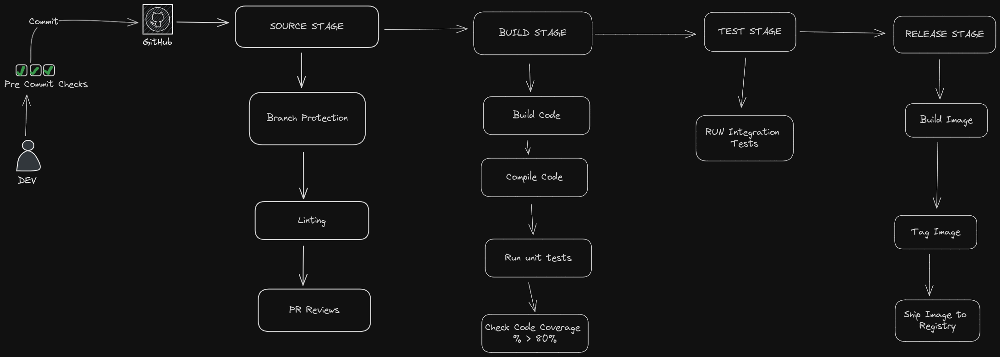

# React Task App

A simple task app built with React that allows users to create tasks. This project was created to learn how to build a CI pipeline.

## Table of Contents

- [Features](#features)
- [Getting Started](#getting-started)
- [CI Pipeline](#ci-pipeline)
- [Docker](#docker)


## Features

- Create tasks
- Simple and user-friendly interface

## Getting Started

To get a local copy up and running follow these simple steps.

### Prerequisites

- Node.js
- npm or yarn

### Installation

1. Clone the repo
   ```sh
   git clone https://github.com/sivuyilemene/task-app.git
   ```
2. Install NPM packages
    ```sh
    npm install
    ```
### Running the App
   ```sh
     npm start
   ```

Open http://localhost:8080 to view it in the browser.

## CI Pipeline


The project uses a Continuous Integration (CI) pipeline with the following stages:

### Pre-commit Checks
- Pre-commit linting and formatting: Ensures code quality with ESLint and Prettier.
- Commit linting: Ensures commit messages follow a conventional format.
### Source Stage
- Branch protection rules: Enforces rules on the main branch so code can only be committed via pull requests.
### Build Stage
- Build and compile code: Ensures the code compiles correctly.
- Run unit tests: Placeholder (not implemented).
- Check code coverage: Placeholder (not implemented).
### Test Stage
- Run integration tests: Ensures the app works as expected end-to-end.
### Release Stage
- Builds Docker image: Packages the app into a Docker image.
- Tags and pushes Docker image: Publishes the Docker image to Docker Hub.

## Docker
To pull and run the Docker image locally, follow these steps:

### Pull the Docker Image
```sh
docker pull sivuyilemene/task-app:latest
```
### Run the Docker Container
```sh
docker run -p 8080:8080 docker.io/sivuyilemene/task-app:latest
```
Open http://localhost:8080 to view it in the browser.
